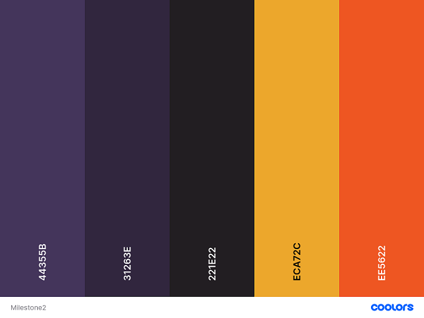

# Hangman | Interactive Frontend Project 

 ====================== PROJECT IMAGE LATER ON 

## Project Overview

 This is the second milestone project in obtaining a **Full-Stack Web Development Diploma** from  **[Code Institute](https://codeinstitute.net/)**. The project is focused on **Javascript**, but **HTML** and **CSS** are used as well. To improve the overall quality and user experience of this website other technologies were used as well. The full list of technologies used can be found in the technologies section of this document. 
 
 At first I was planning to make the game of "Asteroids", but after discussing the idea with my mentor Aaron I decided to go for the game of "Hangman". This being easier to execute and a more straightforward project in general.

**Please note: To open any links in this document in a new browser tab, please press CTRL + Click.**

 ====================== MOCKUP LATER ON

## Table of Content

- [Tradeoff Table](#tradeoff-table)
- [User Experience -UX-](#user-experience--ux-)
  - [User Stories](#user-stories) 
    - [As a New User](#as-a-new-user)
    - [As a Returning User](#as-a-returning-user)
  - [Design](#design)
    - [Colour Scheme](#colour-scheme)
    - [Typography](#typography)
  - [Wireframes](#wireframes)
- [Features](#features)
- [Technologies](#technologies)
  - [Languages](#languages)
  - [Integrations](#integrations)
  - [Version Control- Workspace and Repository Storage](#version-control--workspace-and-repository-storage)
  - [Other Technologies](#other-technologies)
- [Testing](#testing)
- [Deployment](#deployment)
  - [Deployment to Github](#deployment-to-github)
  - [Run Code Locally](#run-code-locally)
    - [Forking Local Repository](#forking-local-repository)
    - [Cloning Local Repository](#cloning-local-repository)
- [Credits](#credits)

## Tradeoff Table
	
Opportunity/Problem | Importance | Viability/Feasibility
--------------------|------------|-----------
Create a page heading | 5 | 5
Add footer items | 3 | 5
Display instructions | 5 | 5
Hangman drawing | 5 | 5
Win/lose text when game ends | 5 | 5
Restart game button | 5 | 4
Score count | 4 | 4
Keyboard on screen | 4 | 3
User can contact site owner | 3 | 3
Timer | 2| 2
Sounds | 2 | 2

[Back to Table of Content](#Table-of-Content) 

## User Experience -UX-

  ### User Stories

  #### As a New User

- As a user, I want to easily see the purpose of the website.
- As a user, I want the game to be responsive and work on all devices.
- As a user, I want a clear explanation on instructions of how to play the game.
- As a user, I want to be able to see how many letters the hidden word has.
- As a user, I want to be able to tell if my guess was successful or not.
- As a user, I want to see a hangman appear when I guess incorrectly.
- As a user, I want there to be a scoring feature.
- As a user, I want to be able to restart the game.

  #### As a Returning User

- As a returning user, I want to be able to get in contact with the owner of the website.

[Back to Table of Content](#Table-of-Content)

### Design

  #### Colour Scheme

The following are the colours used for this project, based on a schematic provided by [Coolors](https://coolors.co/) /

[Back to Table of Content](#table-of-content)

  #### Typography

[Back to Table of Content](#table-of-content)

### Wireframes

Added [Wireframes](https://github.com/nowane/Hangman/blob/master/assets/docs/wireframes/hangman-wireframes.pdf  ) for desktop, tablet and mobile.

[Back to Table of Content](#table-of-content)

## Features

[Back to Table of Content](#table-of-content)

## Technologies

  ### Languages

- [HTML](https://developer.mozilla.org/en-US/docs/Glossary/HTML5) - Used to structure the individual page(s) of the website.

- [CSS](https://developer.mozilla.org/en-US/docs/Web/CSS) - Styling language used to style and colour HTML and dynamic elements.

- [Javascript](https://developer.mozilla.org/en-US/docs/Web/JavaScript) - Used to create and manipulate the dynamic elements of the website.

  ### Integrations

  ### Version Control- Workspace and Repository Storage

- [Git](https://git-scm.com/) - Version control software used to commit and push code to the GitHub repository where the source code is stored.
- [Gitpod](https://www.gitpod.io/) - Main workspace IDE (Integrated Development Environment).
- [GitHub](https://github.com/) - Used to host the deployed website and repository of all previous versions of the build.

  ### Other Technologies

- [Balsamiq](https://balsamiq.com/) - Used to create wireframes for the UX stage of the project.
- [Google Chrome Developer Tools](https://developer.chrome.com/docs/devtools/) - Used throughout building the project testing responsiveness and debugging.
- [Mockup](http://ami.responsivedesign.is/) - Used to create an image of responsiveness on various devices.
- [Slack](https://slack.com/intl/en-nl/) - Used to look up answers to all kind of questions.

[Back to Table of Content](#table-of-content)

## Testing

This [testing document](https://github.com/nowane/Hangman/blob/master/TESTING.md)  contains all testing,

[Back to Table of Content](#table-of-content)

## Deployment

### Deployment to Github

 Deploying to GitHub Pages:
 
- Sign in to GitHub.
- Insert the name of the repository in the search bar: [nowane/Hangman](https://github.com/nowane/Hangman) .
- Click on the repository to view more details.
- Click on settings, which is located in the row above the green Gitpod button.
- Scroll down to the GitHub Pages section.
- Under source, select master in the dropdown menu.
- Select /(root) in the tab which is right next to branch.
- Click Save (page will automatically refresh).
- Scroll down again to the GitHub pages section.
- A container with a blue blackground will tell you: "Your site is ready to be published at https://nowane.github.io/Hangman/ .

[Back to Table of Content](#table-of-content)

### Run Code Locally

You can either fork or clone the local repository on GitHub as follows.

  #### Forking Local Repository

You could make a copy of the GitHub repository by "Forking" the original repository onto your own account by following these steps:

  - Sign in to GitHub.
  - On GitHub, navigate to the [nowane/Hangman](https://github.com/nowane/Hangman) repository.
  - In the top-right corner of the page, click Fork.
  - You should now have a copy of this repository into your GitHub account.

  [Back to Table of Content](#table-of-content)

  #### Cloning Local Repository

 You could make a clone of the GitHub repository by "Cloning" the original repository by following these steps:

  - Sign in to GitHub.
  - On GitHub, navigate to the [nowane/Hangman](https://github.com/nowane/Hangman) repository.
  - Above the repository folder and file content, click “Code”.
  - Select from one of the following options:
    - Clone the files using the url.
      - Copy the url.
      - Create a repository in GitHub and a workspace in your IDE.
      - Open the terminal and type: $ git clone https://github.com/nowane/Hangman.git .
      - All the files should have been imported in your workspace.
    - Download zip files.
      - Create a repository in GitHub and a workspace in your IDE.
      - Unzip the folder.
      - Upload the files into your workspace.

[Back to Table of Content](#table-of-content)

## Credits

[Back to Table of Content](#table-of-content)