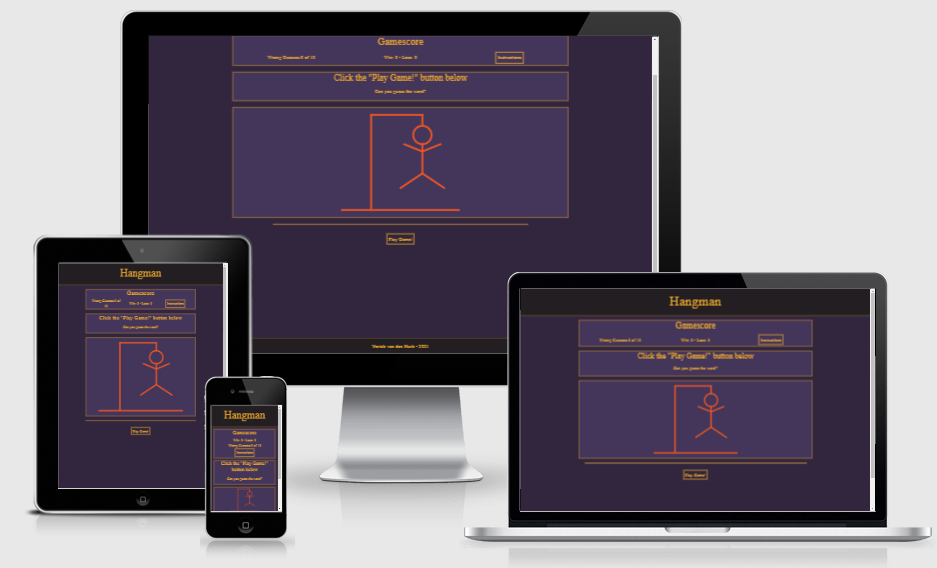
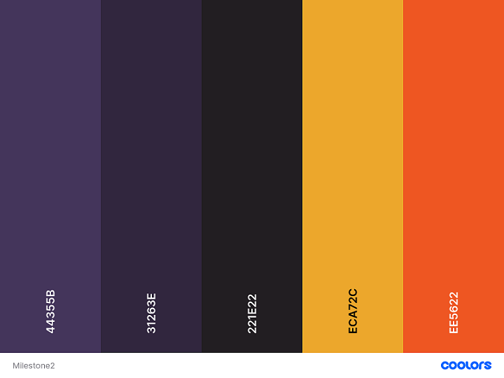

# Hangman | Interactive Frontend Project 

## Project Overview

 This is the second milestone project in obtaining a **Full-Stack Web Development Diploma** from  **[Code Institute](https://codeinstitute.net/)**. The project is focused on **Javascript**, but **HTML** and **CSS** are used as well. To improve the overall quality and user experience of this website other technologies were used as well. The full list of technologies used can be found in the technologies section of this document. 
 
 At first I was planning to make the game of "Asteroids", but after discussing the idea with my mentor Aaron I decided to go for the game of "Hangman". This being easier to execute and a more straightforward project in general.

**Please note: To open any links in this document in a new browser tab, please press CTRL + Click.**

View live website [here](https://github.com/nowane/Hangman).

---

---

## Table of Content

- [Tradeoff Table](#tradeoff-table)
- [User Experience -UX-](#user-experience--ux-)
  - [User Stories](#user-stories) 
    - [As a New User](#as-a-new-user)
    - [As a Returning User](#as-a-returning-user)
  - [Design](#design)
    - [Colour Scheme](#colour-scheme)
    - [Typography](#typography)
  - [Wireframes](#wireframes)
- [Features](#features)
  - [Features implemented](#features-implemented)
  - [Future features](#future-features)
  - [Features changed](#features-changed)
- [Technologies](#technologies)
  - [Languages](#languages)
  - [Integrations](#integrations)
  - [Version Control- Workspace and Repository Storage](#version-control--workspace-and-repository-storage)
  - [Other Technologies](#other-technologies)
- [Testing](#testing)
- [Deployment](#deployment)
  - [Deployment to Github](#deployment-to-github)
  - [Run Code Locally](#run-code-locally)
    - [Forking Local Repository](#forking-local-repository)
    - [Cloning Local Repository](#cloning-local-repository)
- [Credits](#credits)

---

## Tradeoff Table
	
Opportunity/Problem | Importance | Viability/Feasibility
--------------------|------------|-----------
Create a page heading | 5 | 5
Add footer items | 3 | 5
Display instructions | 5 | 5
Hangman drawing | 5 | 5
Win/lose text when game ends | 5 | 5
Restart game button | 5 | 4
Score count | 4 | 4
Keyboard on screen | 4 | 3
User can contact site owner | 3 | 3
Timer | 2| 2
Sounds | 2 | 2

[Back to Table of Content](#Table-of-Content) 

---

## User Experience -UX-

  ### User Stories

  #### As a New User

- As a user, I want to easily see the purpose of the website.
- As a user, I want the game to be responsive and work on all devices.
- As a user, I want a clear explanation on instructions of how to play the game.
- As a user, I want to be able to see how many letters the hidden word has.
- As a user, I want to be able to tell if my guess was successful or not.
- As a user, I want to see a hangman appear when I guess incorrectly.
- As a user, I want there to be a scoring feature.
- As a user, I want to be able to restart the game.

  #### As a Returning User

- As a returning user, I want to be able to get in contact with the owner of the website.

[Back to Table of Content](#Table-of-Content)

---

### Design

  #### Colour Scheme

The colours used for this project are based on a schematic provided by [Coolors](https://coolors.co/) 
- English violet (light purple) - For the use of the main game backgrounds.
- Dark purple - For the use of a darker background to make the inner background stand out, but similar enough to match the inner background to give it an easy look on the eyes.
- Raisin black - To make the header and footer stand out, and dark enough to compliment the lighter colours that will be used.
- Marigold - Used as a nice bright contrast on the darker background.
- Flame (orange) - A warm colour used to put an accent on certain elements of the page.

[Back to Table of Content](#table-of-content)

---

  #### Typography

  Fonts used for this project is Roboto-Mono with a backup of Space-Mono. Both were chosen because of the clean look is has and the even spacing of letters, which is a great feature for a game of Hangman.

[Back to Table of Content](#table-of-content)

---

### Wireframes

Added [Wireframes](https://github.com/nowane/Hangman/blob/master/assets/docs/wireframes/hangman-wireframes.pdf  ) for desktop, tablet and mobile.

[Back to Table of Content](#table-of-content)

---

## Features

### Features implemented

- A big header.
> So the user knows what to expect.

- Responsive layout.
> For better user experience the website will resize according to the device used for better user experience. The game area should also be fully visible on most screen sizes. 

- An instructions button.
> The instructions button (which is a modal) clearly states how the game is meant to be played, and what is to be expected

- Categories shown after instructions.
> If the user chooses to have a more difficult gaming experience, they can choose not to look at the categories and make it harder for themselves.

- A lot of words!
> Per category there are 30 words at the moment, so 120 words in total. This gives the game a lot of replayability and helps providing a good user experience.

- Wrong guesses displayed.
> So that users can easily see how many guesses they have got left.

- Gamescore wins or losses.
> So the user can easily see how many games they have played, and how many they have won or lost.

- The actual hangman figure.
> Starting out blank, with each wrong guess one more piece of the hangman appears, giving the user a visual display of how many guesses are left to be made in the game.

- A play game button.
> When the user presses the button the keyboard will become accessible to click, as well as the hidden word will appear and the game will be set in motion.

- The keyboard buttons.
> When a keyboard button is clicked, it is automatically disabled, so the user knows which letters were already guessed.

- A contact form.
> To get in touch with the owner with questions or suggestions.

- A GitHub icon.
> For the same reason at above.

[Back to Table of Content](#table-of-content)

---

### Future features 

- Choosing a category in the modal.

- Choosing a difficulty.

- Having a leaderboard.

- Storing local data so you can return to your game the next time with statistics still in place.

- Multiplayed.

[Back to Table of Content](#table-of-content)

---

### Features changed

Compared to the wireframes and earlier in the project some things have changed. 

- According to the wireframes there was supposed to be a settings button icon at the top right side. This was supposed to have the following functionality:
  - Categories to be chosen.
  - Difficulty to be set.
  - Sound to be turned on/off.

  This all proved to be out of scope at the moment.

- According to the wireframes there was supposed to be a timer at the top left side of the screen. This was not implemented due to a combination of time management and scope of the project.

- The layout of the hangman an keyboard container changed compared to the wireframes at bigger sizes. This was done to provide a cleaner look and a better UI for the keyboard.

[Back to Table of Content](#table-of-content)

---

## Technologies

  ### Languages

- [HTML](https://developer.mozilla.org/en-US/docs/Glossary/HTML5) - Used to structure the individual page(s) of the website.

- [CSS](https://developer.mozilla.org/en-US/docs/Web/CSS) - Styling language used to style and colour HTML and dynamic elements.

- [Javascript](https://developer.mozilla.org/en-US/docs/Web/JavaScript) - Used to create and manipulate the dynamic elements of the website.

---

  ### Integrations

- [Bootstrap 5](https://getbootstrap.com/) - Used as a framework
- [Font Awesome](https://fontawesome.com/) - Used icons for the GitHub social link icon.
- [Google Fonts](https://fonts.google.com/) - For the fonts used.

---

  ### Version Control- Workspace and Repository Storage

- [Git](https://git-scm.com/) - Version control software used to commit and push code to the GitHub repository where the source code is stored.
- [Gitpod](https://www.gitpod.io/) - Main workspace IDE (Integrated Development Environment).
- [GitHub](https://github.com/) - Used to host the deployed website and repository of all previous versions of the build.

---

  ### Other Technologies

- [Balsamiq](https://balsamiq.com/) - Used to create wireframes for the UX stage of the project.
- [Email JS](https://www.emailjs.com/) - Used to allow the user to send an e-mail to the owner of the game.
- [Google Chrome Developer Tools](https://developer.chrome.com/docs/devtools/) - Used throughout building the project testing responsiveness and debugging.
- [Favicon.io](https://favicon.io/favicon-generator/) - Used to make the favicon.
- [Mockup](http://ami.responsivedesign.is/) - Used to create an image of responsiveness on various devices.
- [Scalable Vector Graphics](https://developer.mozilla.org/en-US/docs/Web/SVG?retiredLocale=nl) for the animated hangman
- [Slack](https://slack.com/intl/en-nl/) - Used to look up answers to all kind of questions.
- [w3](https://validator.w3.org/) - Used to validate HTML.
- [w3](https://jigsaw.w3.org/css-validator/) - Used to validate CSS.
- [jshint](https://jshint.com/) - Used to validate javascript.

[Back to Table of Content](#table-of-content)

---

## Testing

This [testing document](https://github.com/nowane/Hangman/blob/master/TESTING.md)  contains all testing,

[Back to Table of Content](#table-of-content)

---

## Deployment

### Deployment to Github

 Deploying to GitHub Pages:
 
- Sign in to GitHub.
- Insert the name of the repository in the search bar: [nowane/Hangman](https://github.com/nowane/Hangman) .
- Click on the repository to view more details.
- Click on settings, which is located in the row above the green Gitpod button.
- Scroll down to the GitHub Pages section.
- Under source, select master in the dropdown menu.
- Select /(root) in the tab which is right next to branch.
- Click Save (page will automatically refresh).
- Scroll down again to the GitHub pages section.
- A container with a blue blackground will tell you: "Your site is ready to be published at https://nowane.github.io/Hangman/ .

[Back to Table of Content](#table-of-content)

---

### Run Code Locally

You can either fork or clone the local repository on GitHub as follows.

  #### Forking Local Repository

You could make a copy of the GitHub repository by "Forking" the original repository onto your own account by following these steps:

  - Sign in to GitHub.
  - On GitHub, navigate to the [nowane/Hangman](https://github.com/nowane/Hangman) repository.
  - In the top-right corner of the page, click Fork.
  - You should now have a copy of this repository into your GitHub account.

  [Back to Table of Content](#table-of-content)

  ---

  #### Cloning Local Repository

 You could make a clone of the GitHub repository by "Cloning" the original repository by following these steps:

  - Sign in to GitHub.
  - On GitHub, navigate to the [nowane/Hangman](https://github.com/nowane/Hangman) repository.
  - Above the repository folder and file content, click “Code”.
  - Select from one of the following options:
    - Clone the files using the url.
      - Copy the url.
      - Create a repository in GitHub and a workspace in your IDE.
      - Open the terminal and type: $ git clone https://github.com/nowane/Hangman.git .
      - All the files should have been imported in your workspace.
    - Download zip files.
      - Create a repository in GitHub and a workspace in your IDE.
      - Unzip the folder.
      - Upload the files into your workspace.

[Back to Table of Content](#table-of-content)

---

## Credits

- Thanks to my mentor Aaron Sinnott for his help.
- Thanks to Emmet H Becirovic for his time to helping me with the function of disabling the keyboar when the window is loaded. I did not get it working by myself.
- Thanks to the slack-community in general.

[Back to Table of Content](#table-of-content)