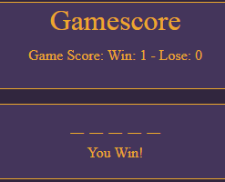

# Testing

- Manual testing of each section of the site (such as buttons, links etc).

- Testing site responsiveness (using a site like https://responsivedesignchecker.com/  ). 

- Code validation (CSS/HTML/JS using online tools like https://jigsaw.w3.org/css-validator/ and JSHint).

- Testing of all user stories.

## Documentation of any bugs encountered and their resolution steps. 

### When trying to get the onscreen keyboard to work I tried al sorts of things to get the hidden letters accepting the letters from user iput. I had a function split up in three different pieces. One piece of the function per 1 row of letters on a keyboard. 
    > In the end the solution took me about a day an a half to come up with, and I came across it by accident.. It came down to the fact I used  uppercase letters in the keyboard rows, and those did not work on the words to be generated I put in - being lowercase.

### When trying to clear the "You Win/Lose"-message the keyboard didn't reload when starting a new game. 
    > This was solved creating a different container for the message.

### With the starting of a new word, underscores matching the new word don't load. Instead they remain the same as from the former word. Their display will update after a first guess from the user.
    > The order in which functions were resetted when restarting the game was wrong. This was corrected.
    > 

### When the game is won +1 is added to "win". However after the game ends the user can still click on the letter-input. When this happens there is still added +1 to mistakes and when the maximum amount of guesses is reached there will be added +1 to "lose" as well.
    > This was solved by removing the keyboard after the game ends. For symmetry this also happens when a game is lost as well, even though a user obviously can't still "win" the game after a loss.
    > 

### Game would finish before last part of the hangman figure was drawn.
    > Max allowed guesses changed from 9 to 10.

### Hangman already displays as a whole on game start, and disappears after first input.
    > Apparently forgot to add the drawFigure() function at the bottom of app.js. This solved the issue.

### Keyboard was clickable before the start of the game.
    > Disabling the keyboard before the play-function ran solved this. 

### When loading the page the hangman figure briefly shows up when loaded, and disappears after a split second.
    > As an aesthetic choice decided to have the full hangman image displayed before the game starts. Otherwise the gamefield looks a bit too clean when the used first visits the page.

### Hangman figure displays parts of the hangman even after correct input. For example: When the user guesses a letter correctly, there isn't a new part of the hangman displayed, however when the user after this guesses incorrectly, the hangman figure displays two new parts instead of one.
    > Eventually I found out that I simply used the variable which concerned all letter input, not just the wrong one. I expected this from the start, still apparently I somehow missed it when I checked it.

### At a size of around 822 x 530 pixels (depending on whether the accent lies on making the screen smaller or shorter from that point onwards) the hangman-figure starts to get shorter compared to it's left-side section of the keyboard due to pixel-ratio if the svg-image.
    > The problem was that the div which contained the keyboard was unable to scale in the same way as the hangman-div it had next to is. Responsiveness in a UX-friendly way became difficult because of this, so I decided to place the keyboard at the bottom. This is the same on on small sizes, except for the fact that on larger screens the keyboard it doesn't gets wider than 800px. This means it will be smaller than the sections above it, which in my opinion gives it a cleaner look.
    > [screenshot](assets/images/testing/keyboardhangmanmismatch.PNG)

### When Making the 404-page, git loaded a strange error onto the page.
    > Making a new commit and pushing to GitHub solved this.
    > 

## Documentation of any open bugs (ideally, test cases should focus on each individual section of every page on the website).

    - 

[Back to README.md](https://github.com/nowane/Hangman/blob/master/README.md)

[Back to Repository](https://github.com/nowane/Hangman)

