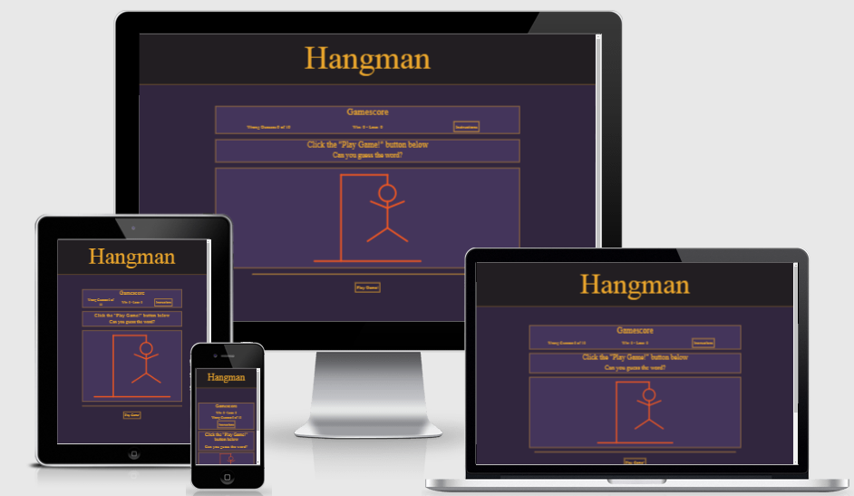
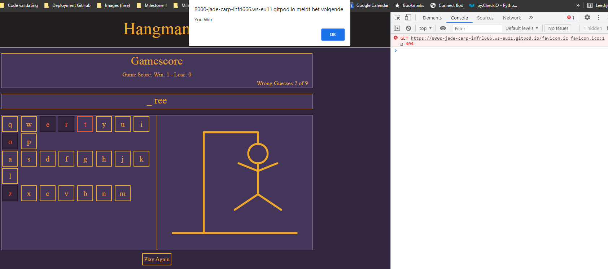
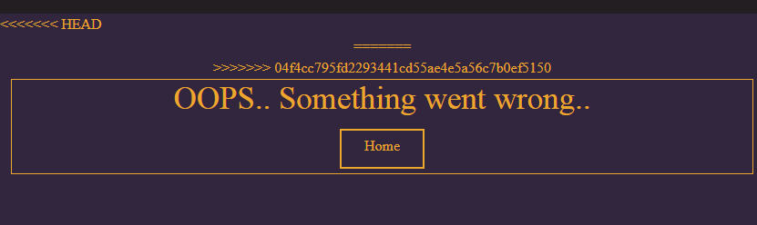

# Testing

## Table of Content

- [Manual testing of each section of the site](#manual-testing-of-each-section-of-the-site)
- [Testing site responsiveness](#testing-site-responsiveness)
- [Code validation](#code-validation)
    - [HTML](#html)
    - [CSS](#css)
    - [Javascript](#javascript)
- [Testing of user stories](#testing-of-user-stories) 
    - [Testing as a new user](#testing-as-a-new-user)
    - [Testing as a returning user](#testing-as-a-returning-user)
- [Documentation of any bugs encountered and their resolution steps](#documentation-of-any-bugs-encountered-and-their-resolution-steps)
- [Documentation of any open bugs](#documentation-of-any-open-bugs)

## Manual testing of each section of the site

(such as buttons, links etc)

[Back to the top](#testing)

## Testing site responsiveness 

A mockup of the project, displaying responsiveness.

[Back to the top](#testing)

---

## Code validation

### HTML

Code validated using https://validator.w3.org/ .

[Back to the top](#testing)

### CSS

Code validated using https://jigsaw.w3.org/css-validator/ .

[Back to the top](#testing)

### Javascript

Code validated from https://jshint.com/ .

> The words variable is used in the main file (assets/js/hangman.js) .

> The generateButtons function is used in the main file (assets/js/hangman.js) .

> The sendMail() function is used as an function in (index.html) to send the contact form.
> Emailjs was setup according to emailJS documentation. There was no necessity to declare variable emailjs.

[Back to the top](#testing)

## Testing of user stories.

  ### Testing as a new user

- As a user, I want to easily see the purpose of the website.
    > When the website opens straight away the user can see it's a webpage of a game, ant what it's purpose is.

- As a user, I want the game to be responsive and work on all devices.
    > The website works as well on small as on bigger screens. 

- As a user, I want a clear explanation on instructions of how to play the game.
    > When the user presses the "Instructions"-button in the right top corner, the user can read what is to be expected of the game.

- As a user, I want to be able to see how many letters the hidden word has.
    > When the user presses the "Play Game!"-button, just above the screens center of the screen there appeear underscores. Each underscore presents a hidden letter.

- As a user, I want to be able to tell if my guess was successful or not.
    > When the user makes a guess for a letter, there will be a reaction on the webpage. Whenever the user guesses a letter correctly, this letter (or possibly more than one if that letter occupies the given word multiple times) will appear on screen. If the user guesses incorrectly, the will be added +1 to his wrong guesses, as well as that there will be added a piece of the hangman figure. When the user has got no letters left to guess due to having guessed all letters or making too many mistakes, they will see the message: "You win!" or "You Lose", as well as that there will be added +1 to wins or losses.

- As a user, I want to see a hangman appear when I guess incorrectly.
    > The user will see a piece of the hangman figure appear after a wrong guess, with a maximum of 10 wrong guesses. Then the figure is complete and the game is lost.

- As a user, I want there to be a scoring feature.
    > After the user wins or loses a game, there will be added +1 at the "win" or "lose" in the top center of the screen.

- As a user, I want to be able to restart the game.
    > When a game ends the user is awarded with a point (+1) at "win" or "lose". When the user presses the "Play Again!" button the user can continue playing, as well as see the score incremented.
    

  ### Testing as a returning user

- As a returning user, I want to be able to get in contact with the owner of the website.
    > In the bottom left of the webpage there is a "Contact"-button. When a user presses this they can send me an e-mail to get in contct with me.

[Back to the top](#testing)

## Documentation of any bugs encountered and their resolution steps
---
### When trying to get the onscreen keyboard to work I tried al sorts of things to get the hidden letters accepting the letters from user iput. I had a function split up in three different pieces. One piece of the function per 1 row of letters on a keyboard. 
 > In the end the solution took me about a day an a half to come up with, and I came across it by accident.. It came down to the fact I used  uppercase letters in the keyboard rows, and those did not work on the words to be generated I put in - being lowercase.

---

### When trying to clear the "You Win/Lose"-message the keyboard didn't reload when starting a new game. 
> This was solved creating a different container for the message.

---

### With the starting of a new word, underscores matching the new word don't load. Instead they remain the same as from the former word. Their display will update after a first guess from the user.
> The order in which functions were resetted when restarting the game was wrong. This was corrected.

---

### When the game is won +1 is added to "win". However after the game ends the user can still click on the letter-input. When this happens there is still added +1 to mistakes and when the maximum amount of guesses is reached there will be added +1 to "lose" as well.
> This was solved by removing the keyboard after the game ends. For symmetry this also happens when a game is lost as well, even though a user obviously can't still "win" the game after a loss.

---

### Game would finish before last part of the hangman figure was drawn.
> Max allowed guesses changed from 9 to 10.

---

### Hangman already displays as a whole on game start, and disappears after first input.
> Apparently forgot to add the drawFigure() function at the bottom of app.js. This solved the issue.

---

### Keyboard was clickable before the start of the game.
> Disabling the keyboard before the play-function ran solved this. 

---

### When loading the page the hangman figure briefly shows up when loaded, and disappears after a split second.
> As an aesthetic choice decided to have the full hangman image displayed before the game starts. Otherwise the gamefield looks a bit too clean when the used first visits the page.

---

### Hangman figure displays parts of the hangman even after correct input. For example: When the user guesses a letter correctly, there isn't a new part of the hangman displayed, however when the user after this guesses incorrectly, the hangman figure displays two new parts instead of one.
> Eventually I found out that I simply used the variable which concerned all letter input, not just the wrong one. I expected this from the start, still apparently I somehow missed it when I checked it.

---

### At a size of around 822 x 530 pixels (depending on whether the accent lies on making the screen smaller or shorter from that point onwards) the hangman-figure starts to get shorter compared to it's left-side section of the keyboard due to pixel-ratio if the svg-image.
> The problem was that the div which contained the keyboard was unable to scale in the same way as the hangman-div it had next to is. Responsiveness in a UX-friendly way became difficult because of this, so I decided to place the keyboard at the bottom. This is the same on on small sizes, except for the fact that on larger screens the keyboard it doesn't gets wider than 800px. This means it will be smaller than the sections above it, which in my opinion gives it a cleaner look.

---

### When Making the 404-page, git loaded a strange error onto the page.
> Making a new commit and pushing to GitHub solved this.

--- 

[Back to the top](#testing)

## Documentation of any open bugs 

(ideally, test cases should focus on each individual section of every page on the website).

During building of this project this error showed up on top of the console log on the deployed (via GitHub) website, an is still there:  "Error with Permissions-Policy header: Unrecognized feature: 'interest-cohort'."  
> This is coming from an implementation from GitHub itself which is part of an effort to ensure the privacy of our users when browsing GitHub Pages websites. For more information about the topic click [here](https://developer.mozilla.org/en-US/docs/Web/HTTP/Headers/Feature-Policy).

[Back to the top](#testing)

[Back to README.md](https://github.com/nowane/Hangman/blob/master/README.md)

[Back to Repository](https://github.com/nowane/Hangman)

